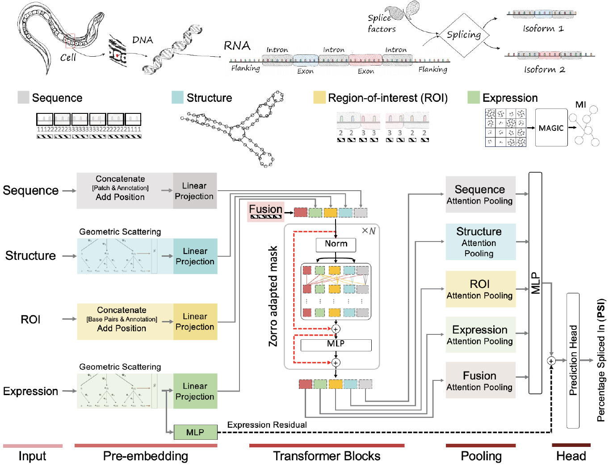

# CellSpliceNet: Interpretable Multimodal Modeling of Alternative Splicing Across Neurons in *C. elegans*

[](https://www.python.org/)
[](https://pytorch.org/)
[](https://developer.nvidia.com/cuda-toolkit)
[](#requirements)
[](#license)

> **CellSpliceNet** is an interpretable transformer-based multimodal deep learning framework that predicts splicing outcomes across neurons in *C. elegans* by integrating four complementary data modalities.

**Authors:** Arman Afrasiyabi, Jake Kovalic, Chen Liu, Egbert Castro, Alexis Weinreb, Erdem Varol, David M. Miller III, Marc Hammarlund, Smita Krishnaswamy

**Quick links:**  
📄 [Preprint (bioRxiv)](https://www.biorxiv.org/content/10.1101/2025.06.22.660966v1) · 🧪 [Dataset](https://github.com/KrishnaswamyLab/CellSpliceNet-dataset) · 💻 [Repo](https://github.com/KrishnaswamyLab/CellSpliceNet) · 

---

## Abstract

We introduce CellSpliceNet, an interpretable transformer-based multimodal deep learning framework designed to predict splicing outcomes across the neurons of *C. elegans*. By integrating four complementary data modalities—(1) long-range genomic sequence, (2) local regions of interest (ROIs) in the RNA sequence, (3) secondary structure, and (4) gene expression—CellSpliceNet captures the complex interplay of factors that influence splicing decisions within the cellular context. CellSpliceNet employs modality-specific transformer embeddings, incorporating structural representations guided by mutual information and scattering graph embeddings. A carefully designed multimodal multi-head attention mechanism preserves the integrity of each modality while enabling selective cross-modal interactions (e.g., allowing gene expression to inform sequence/structure signals). Attention-based pooling within each modality highlights biologically critical elements, such as canonical intron–exon splice boundaries and accessible single-stranded RNA loop structures within exons.

<p align="center">
  
</p>

---

## Highlights

- **Multimodal fusion:** sequence (global + ROI), secondary structure, and gene expression.  
- **Interpretable attention:** modality-specific pooling surfaces biologically relevant signals (e.g., splice boundaries, loop accessibility).  
- **Selective cross-modal attention:** preserves modality integrity while enabling targeted information flow.   

---

## Table of Contents

- [Repository Structure](#repository-structure)  
- [Requirements](#requirements)  
- [Installation](#installation)  
- [Data: Download & Configure](#data-download--configure)  
- [Quickstart: Train & Validate](#quickstart-train--validate)  
- [Pretrained Weights](#pretrained-weights)  
- [Troubleshooting](#troubleshooting)  
- [Contributing](#contributing)  
- [License](#license)  
- [Citation](#citation)

---

## Repository Structure

```
CellSpliceNet/
  src/
    data/           # datasets + dataloaders
    models/         # model definitions (transformers, heads, etc.)
    nn/             # neural modules and layers
    utils/          # logging, seeding, config helpers, misc
    viz/            # visualization utilities for results/attention maps
    train.py        # train/eval loops
  pp/               # (optional) pre/post-processing assets; preprocessed data provided
  requirements.txt
  LICENSE
  README.md
```

---

## Requirements

- **OS:** Enterprise Linux 8.10 (other modern Linux distros likely fine)  
- **Python:** 3.9.18  
- **CUDA:** 11.3.1 (for GPU training)  
- **PyTorch:** 1.10.2  
- **Dependencies:** see `requirements.txt` *(or `environment.yml` if provided)*

---

## Installation

### 1) Clone
```bash
git clone https://github.com/KrishnaswamyLab/CellSpliceNet
cd CellSpliceNet
```

### 2) Environment (choose one)

**Conda (recommended)**
```bash
# If your HPC requires modules, load them first (otherwise skip):
# module load CUDA/11.3.1 CUDAcore/11.3.1 cuDNN/8.2.1.32-CUDA-11.3.1

# Option A: from environment.yml (if present)
conda env create -f environment.yml -n CellSpliceNet

# Option B: from requirements.txt
conda create -n CellSpliceNet python=3.9
conda activate CellSpliceNet
pip install -r requirements.txt

# Install PyTorch matching your CUDA (example for CUDA 11.3):
# (Adjust to your platform if needed)
pip install torch==1.10.2 torchvision==0.11.3 torchaudio==0.10.2
```

**Virtualenv**
```bash
python3.9 -m venv .venv
source .venv/bin/activate
pip install -r requirements.txt
```

> **Tip:** If you see a CUDA version mismatch at runtime, reinstall PyTorch with the correct CUDA build.

---

## Data: Download & Configure

1. Download the dataset: **[CellSpliceNet-dataset](https://github.com/KrishnaswamyLab/CellSpliceNet-dataset)**  
2. Set the dataset root in `src/args.py`:
   ```python
   dataset_root = "/path/to/your/dataset"
   ```
   *(If the code supports CLI/environment overrides in your fork, you can use those instead; otherwise edit `args.py`.)*

---

## Quickstart: Train & Validate

Run the default training loop (includes validation as configured):
```bash
python src/train.py
```

- Logs, checkpoints, and metrics will be saved as defined in `src/utils` (and/or your config).
- For experiment control (epochs, batch size, etc.), update `src/args.py` (or your config system if present).

---

## Pretrained Weights

A pretrained model is available here: **[CellSpliceNet.pth](https://drive.google.com/drive/folders/1pVfKlGspW1sOB1W-rr9SQD_qas4u8uhy?usp=drive_link)**.  
Download the weights and point your configuration/checkpoint loader to the file path per your setup.

---

## Troubleshooting

- **CUDA mismatch / “CUDA driver version is insufficient”:**  
  Ensure your installed PyTorch build matches your system CUDA (or use the CPU build).
- **Out of GPU memory:**  
  Reduce `batch_size` and/or sequence length; consider gradient accumulation or mixed precision (AMP).
- **Dataset path errors:**  
  Double-check `dataset_root` in `src/args.py` and that the expected subfolders/files exist.
- **Image not rendering in README:**  
  Confirm the filename is exactly `CellSplceNet.png` in the repository root (case-sensitive on Linux).

---

## Contributing

Contributions are welcome! Please open an issue to discuss major changes. For pull requests:
1. Fork the repo and create a feature branch.  
2. Add or update tests if applicable.  
3. Ensure style/formatting is consistent.  
4. Open a PR with a clear description and motivation.

---

## License

This project is distributed under the terms specified in the **[LICENSE](https://github.com/KrishnaswamyLab/CellSpliceNet/blob/main/LICENSE.md)** file.

---

## Citation

If you use this repository, models, or ideas in your research, please cite:

```bibtex
@article{Afrasiyabi2025CellSpliceNet,
  title   = {CellSpliceNet: Interpretable Multimodal Modeling of Alternative Splicing Across Neurons in C. elegans},
  author  = {Afrasiyabi, Arman and Kovalic, Jake and Liu, Chen and Castro, Egbert and Weinreb, Alexis and Varol, Erdem and Miller, David M., III and Hammarlund, Marc and Krishnaswamy, Smita},
  journal = {bioRxiv},
  year    = {2025},
  doi     = {10.1101/2025.06.22.660966},
  url     = {https://www.biorxiv.org/content/10.1101/2025.06.22.660966v1}
}
```
